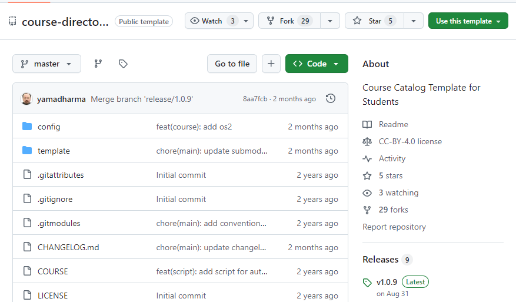
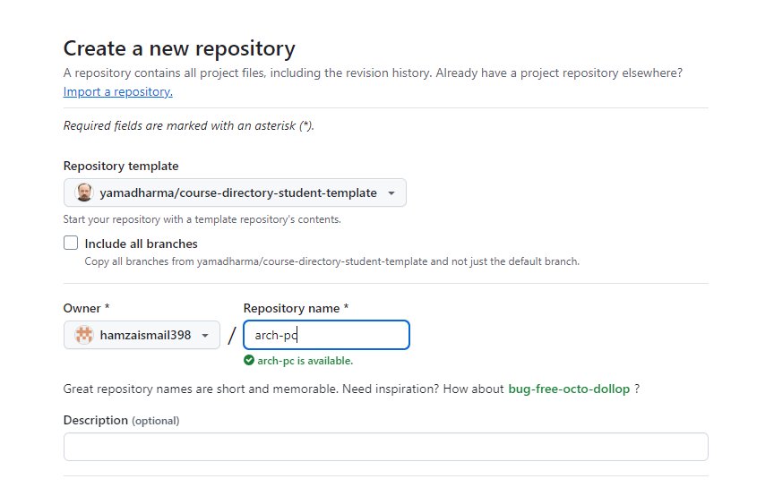
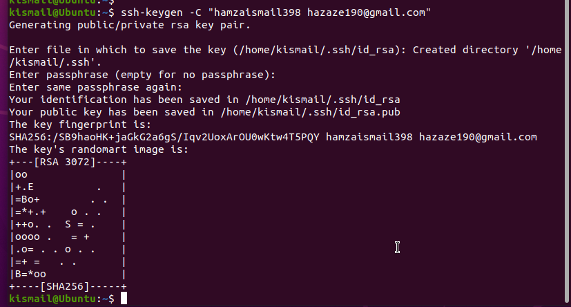
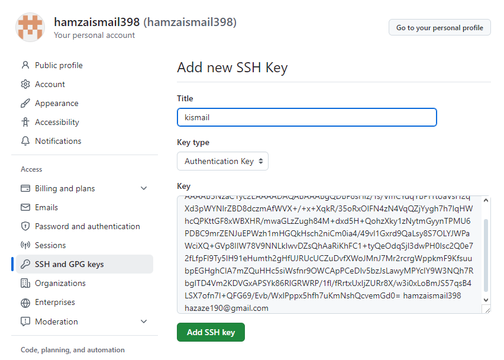
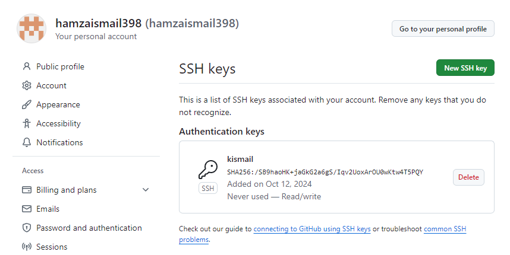
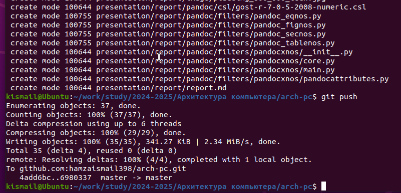
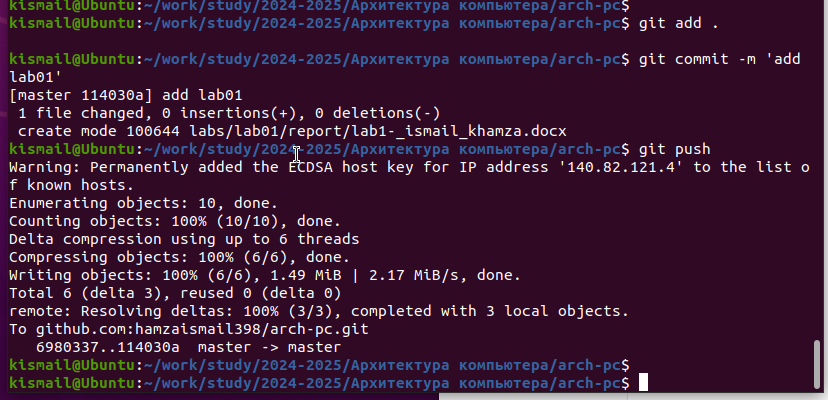

---
## Front matter
title: "Отчёт по лабораторной работе 2"
subtitle: "Архитектура компьютера"
author: "Исмаил Хамза НКАбд-03-24"

## Generic otions
lang: ru-RU
toc-title: "Содержание"

## Bibliography
bibliography: bib/cite.bib
csl: pandoc/csl/gost-r-7-0-5-2008-numeric.csl

## Pdf output format
toc: true # Table of contents
toc-depth: 2
lof: true # List of figures
lot: true # List of tables
fontsize: 12pt
linestretch: 1.5
papersize: a4
documentclass: scrreprt
## I18n polyglossia
polyglossia-lang:
  name: russian
  options:
	- spelling=modern
	- babelshorthands=true
polyglossia-otherlangs:
  name: english
## I18n babel
babel-lang: russian
babel-otherlangs: english
## Fonts
mainfont: PT Serif
romanfont: PT Serif
sansfont: PT Sans
monofont: PT Mono
mainfontoptions: Ligatures=TeX
romanfontoptions: Ligatures=TeX
sansfontoptions: Ligatures=TeX,Scale=MatchLowercase
monofontoptions: Scale=MatchLowercase,Scale=0.9
## Biblatex
biblatex: true
biblio-style: "gost-numeric"
biblatexoptions:
  - parentracker=true
  - backend=biber
  - hyperref=auto
  - language=auto
  - autolang=other*
  - citestyle=gost-numeric
## Pandoc-crossref LaTeX customization
figureTitle: "Рис."
tableTitle: "Таблица"
listingTitle: "Листинг"
lofTitle: "Список иллюстраций"
lotTitle: "Список таблиц"
lolTitle: "Листинги"
## Misc options
indent: true
header-includes:
  - \usepackage{indentfirst}
  - \usepackage{float} # keep figures where there are in the text
  - \floatplacement{figure}{H} # keep figures where there are in the text
---

# Цель работы

Целью работы является изучить идеологию и применение средств контроля версий. Приобрести практические навыки по работе с системой git.

# Задания

1.	Настройка GitHub.

2.	Базовая настройка git.

3.	Создание SSH ключа.

4.	Создание рабочего пространства и репозитория курса на основе шаблона.

5.	Создание репозитория курса на основе шаблона.

6.	Настройка каталога курса.

7.	Выполнение заданий для самостоятельной работы.

# Теоретическое введение

Системы контроля версий (Version Control System, VCS) применяются при работе нескольких человек 
над одним проектом. Обычно основное дерево проекта хранится в локальном или удалённом 
репозитории, к которому настроен доступ для участников проекта. При внесении изменений 
в содержание проекта система контроля версий позволяет их фиксировать, совмещать изменения, 
произведённые разными участниками проекта, производить откат к любой более ранней версии 
проекта, если это требуется. В классических системах контроля версий используется 
централизованная модель, предполагающая наличие единого репозитория для хранения файлов. 
Выполнение большинства функций по управлению версиями осуществляется специальным сервером. 
Участник проекта (пользователь) перед началом работы посредством определённых команд получает 
нужную ему версию файлов. После внесения изменений пользователь размещает новую версию 
в хранилище. При этом предыдущие версии не удаляются из центрального хранилища и к ним можно 
вернуться в любой момент. Сервер может сохранять не полную версию изменённых файлов, 
а производить так называемую дельта-компрессию — сохранять только изменения между 
последовательными версиями, что позволяет уменьшить объём хранимых данных. 
Системы контроля версий поддерживают возможность отслеживания и разрешения конфликтов, 
которые могут возникнуть при работе нескольких человек над одним файлом. Можно объединить 
изменения, сделанные разными участниками, вручную выбрать нужную версию, отменить изменения 
вовсе или заблокировать файлы для изменения. В зависимости от настроек блокировка не позволяет 
другим пользователям получить рабочую копию или препятствует изменению рабочей копии файла 
средствами файловой системы ОС, обеспечивая таким образом привилегированный доступ только 
одному пользователю, работающему с файлом. Системы контроля версий также могут обеспечивать 
дополнительные, более гибкие функциональные возможности. Например, они могут поддерживать 
работу с несколькими версиями одного файла, сохраняя общую историю изменений до точки 
ветвления версий и собственные истории изменений каждой ветви. Обычно доступна информация 
о том, кто из участников, когда и какие изменения вносил. Обычно такого рода информация 
хранится в журнале изменений, доступ к которому можно ограничить. В отличие от классических, 
в распределённых системах контроля версий центральный репозиторий не является обязательным. 
Среди классических VCS наиболее известны CVS, Subversion, а среди распределённых — Git, 
Bazaar, Mercurial. Принципы их работы схожи, отличаются они в основном синтаксисом 
используемых в работе команд. Система контроля версий Git представляет собой набор 
программ командной строки. Доступ к ним можно получить из терминала посредством ввода 
команды git с различными опциями. Благодаря тому, что Git является распределённой системой 
контроля версий, резервную копию локального хранилища можно сделать простым копированием 
или архивацией. Работа пользователя со своей веткой начинается с проверки и получения 
изменений из центрального репозитория (при этом в локальное дерево до начала этой процедуры 
не должно было вноситься изменений). Затем можно вносить изменения в локальном дереве и/или 
ветке. После завершения внесения какого-то изменения в файлы и/или каталоги проекта необходимо 
разместить их в центральном репозитории.

# Выполнение лабораторной работы

## Подготовка GitHub репозитория

Регистрирую учетную запись на GitHub
Приступаю к созданию репозитория на основе шаблона.
(рис. [-@fig:001], [-@fig:002], [-@fig:003])

{ #fig:001 width=70%, height=70% }

{ #fig:002 width=70%, height=70% }

{ #fig:003 width=70%, height=70% }

Теперь подключимся к репозиторию из системы линукс.
Для этого задаем параметры. (рис. [-@fig:004])

{ #fig:004 width=70%, height=70% }

SSH ключ нужен для авторизации пользователя. Создаем его (рис. [-@fig:005])

{ #fig:005 width=70%, height=70% }

Теперь данные ключа нужно добавить в профиль на гитхабе. Тогда гитхаб будет узнавать нас по ключу.
 (рис. [-@fig:006], [-@fig:007])

{ #fig:006 width=70%, height=70% }

{ #fig:007 width=70%, height=70% }

Создаем папку на компьютере и клонируем 
в нее содержимое репозитория, т е шаблон.(рис. [-@fig:008]])

{ #fig:008 width=70%, height=70% }

Оформили курс по шаблону и загрузили в сетевой репозиторий
(рис. [-@fig:009], [-@fig:010])

{ #fig:009 width=70%, height=70% }

{ #fig:010 width=70%, height=70% }

Также загрузили в сетевой репозиторий отчеты по сделанным работам (рис. [-@fig:011])

{ #fig:011 width=70%, height=70% }

# Выводы

При выполнении данной лабораторной работы я изучил идеологию и применение 
средств контроля версий, а также приобрел практические навыки по работе с системой git.

# Список литературы{.unnumbered}

1. Архитектура ЭВМ

2. Git - gitattributes Документация
